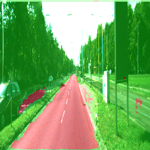

# Image Segmentation PyTorch
Image Segmentation using Fully Convolutional Networks in PyTorch on the [KITTI road dataset](http://www.cvlibs.net/datasets/kitti/eval_road.php).

**Original paper**: [Fully Convolutional Networks for Semantic Segmentation](https://arxiv.org/abs/1411.4038), 2015, Jonathan Long et al.

## Preparing the dataset

Download the dataset from the KITTI Vision Benchmark Suite website. Click on the link corresponding to this dataset: `Download base kit with: left color images, calibration and training labels (0.5 GB)`. Here is the [direct link](http://www.cvlibs.net/download.php?file=data_road.zip) where you would need to provide your email address to request a download link. Once you download the dataset, extract and keep it in the root directory of your project (preferably).

## Using the repository

Clone the repository to the machine where you want to run the model.

```bash
git clone https://github.com/adityashrm21/image-segmentation-pytorch.git
```
It is preferable but not necessary to use a GPU as we are using a pre-trained ImageNet model.

### Requirements

- [pytorch](https://pytorch.org/get-started/locally/) >= 1.0.1
- [torchvision](https://github.com/pytorch/vision) >= 0.2.1
- [numpy](https://github.com/numpy/numpy) >= 1.15.4
- [opencv](https://github.com/opencv/opencv) >= 4.1.0.25
- [scikit-image](https://github.com/scikit-image/scikit-image) >= 0.14.1

### Model usage

You can simply train and do the inference on test set using:

```bash
python3 train.py --output_dir "inference/" --root_dir "data_road"
```
Here is a complete list of arguments:

```bash
usage: train.py [-h] --output_dir OUTPUT_DIR --root_dir ROOT_DIR
                [--model MODEL] [--epochs EPOCHS] [--n_class N_CLASS]
                [--batch_size BATCH_SIZE] [--lr LR] [--momentum MOMENTUM]
                [--weight_decay WEIGHT_DECAY]

optional arguments:
  -h, --help            show this help message and exit
  --output_dir OUTPUT_DIR
                        output directory for test inference
  --root_dir ROOT_DIR   root directory for the dataset
  --model MODEL         model architecture to be used for FCN
  --epochs EPOCHS       num of training epochs
  --n_class N_CLASS     number of label classes
  --batch_size BATCH_SIZE
                        training batch size
  --lr LR               learning rate
  --momentum MOMENTUM   momentum for SGD
  --weight_decay WEIGHT_DECAY
                        weight decay for L2 penalty
```

## Results

Some output images from the test set after the inference stage:




